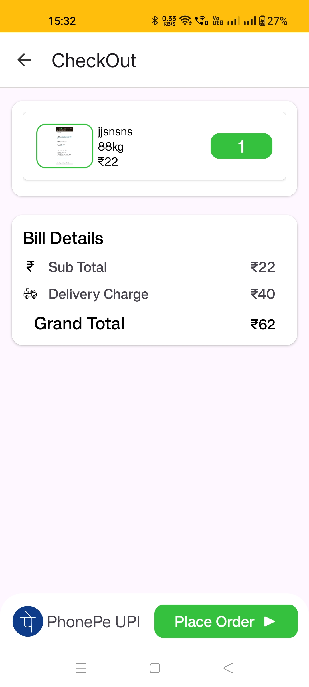

# TurboMart 🛒

**TurboMart** is a modern, feature-rich Android application for last-minute grocery shopping, inspired by leading quick-commerce platforms. It offers a seamless user experience for browsing, searching, and ordering groceries, with real-time order tracking and integrated digital payments.

---

## Demo video

## 🚀 Features

- **User Authentication**: Secure OTP-based phone number login.
- **Product Catalog**: Browse a wide range of grocery categories (Fruits & Vegetables, Dairy, Snacks, Beverages, Personal Care, and more).
- **Search & Filter**: Quickly find products with advanced search and category filters.
- **Cart Management**: Add, update, or remove products from your cart with real-time price calculation.
- **Order Placement**: Place orders with address management and order summary.
- **Digital Payments**: Integrated with Razorpay.
- **Order Tracking**: View your order history and track current orders.
- **Push Notifications**: Get real-time updates on order status and promotions.
- **Persistent Storage**: Cart and user data are stored locally using Room DB and synced with Firebase.
- **Modern UI/UX**: Clean, responsive, and visually appealing interface with Lottie animations and shimmer effects.

---

## 🏗️ Tech Stack

- **Kotlin** & **Android Jetpack** (ViewModel, LiveData, Navigation)
- **Firebase** (Authentication, Realtime Database, Cloud Messaging)
- **Room Database** for local persistence
- **Retrofit** for API calls
- **Razorpay** for payments
- **Lottie** for animations, **Glide** for image loading
- **Material Components** for UI

---

## 📲 User Flow

1. **Splash Screen**: App checks for existing user session.
2. **Sign In**: User enters phone number, receives OTP, and logs in.
3. **Home**: Browse featured products, categories, and best sellers.
4. **Search**: Find products by name or filter by category.
5. **Product Details**: View product info, add to cart, adjust quantity.
6. **Cart**: Review selected items, update quantities, proceed to checkout.
7. **Address**: Enter or select delivery address.
8. **Payment**: Pay securely via Razorpay.
9. **Order Confirmation**: View order summary and track status.
10. **Profile**: Manage address, view order history, and log out.

---

## 💳 Payment Integration

- **Razorpay**: For card, UPI, and wallet payments.
- **Order status** is updated in real-time after payment confirmation.

---

## 📦 Data Model

- **Products**: Title, price, quantity, category, images, stock.
- **Cart**: Local Room DB for offline persistence.
- **Orders**: Linked to user, includes items, address, status, and date.
- **Users**: Phone number, address, FCM token.

---

## 🔔 Notifications

- **Order updates** and promotional messages are sent via Firebase Cloud Messaging.
- Custom notification service for rich notifications.

---

## 🚀 Admin App Link
- [TurboMartAdmin](https://github.com/Piyushh10/TurboMartAdmin)

---

## 📸 Screenshots

 

 

 

---

## 🙌 Credits

- Inspired by Blinkit, Zepto, and other quick-commerce apps.
- Built with ❤️ 

---

**Contact me -** – _[shivnanip815@gmail.com]_ 
